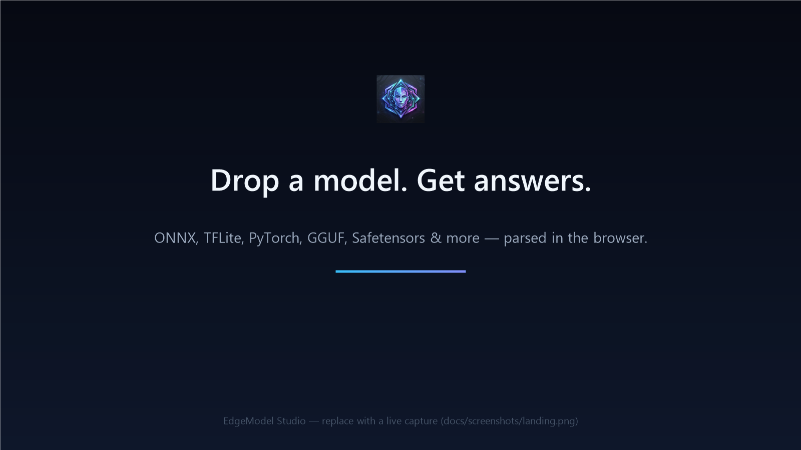
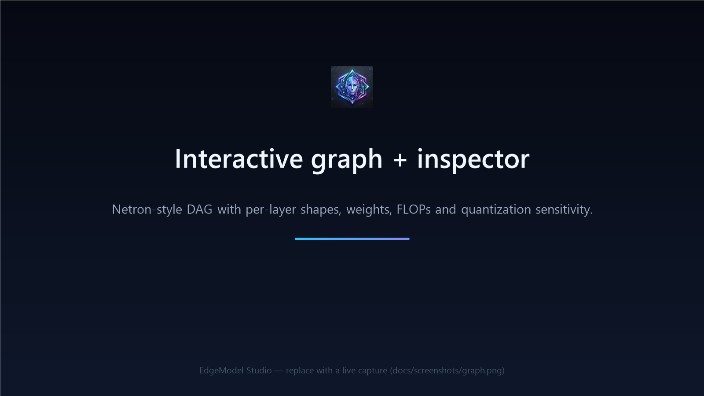
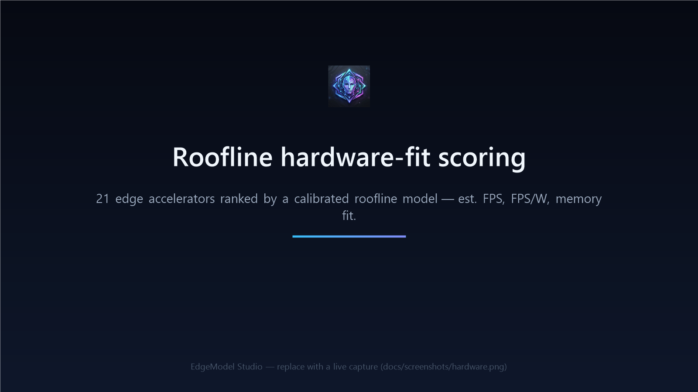
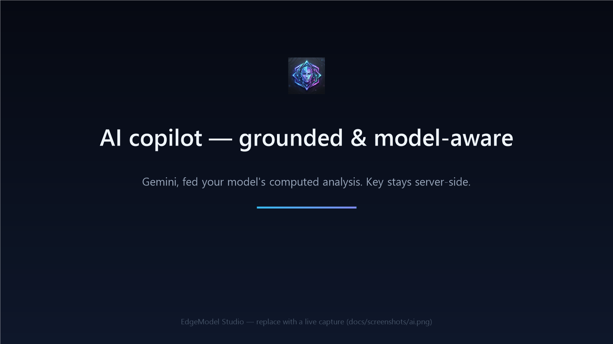
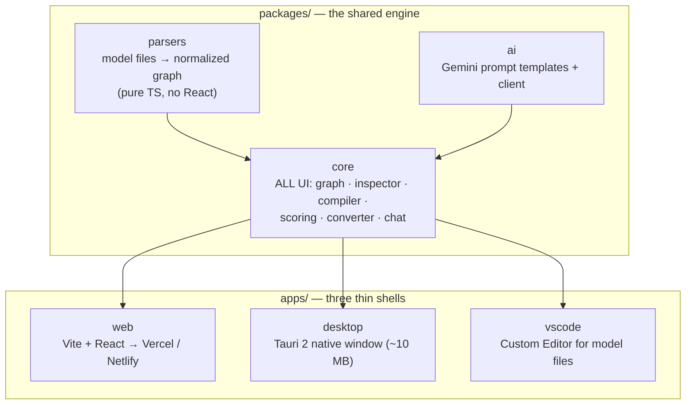
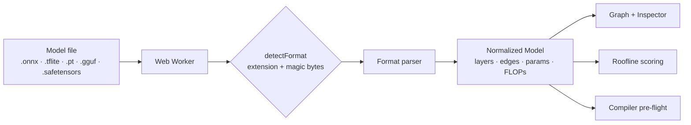
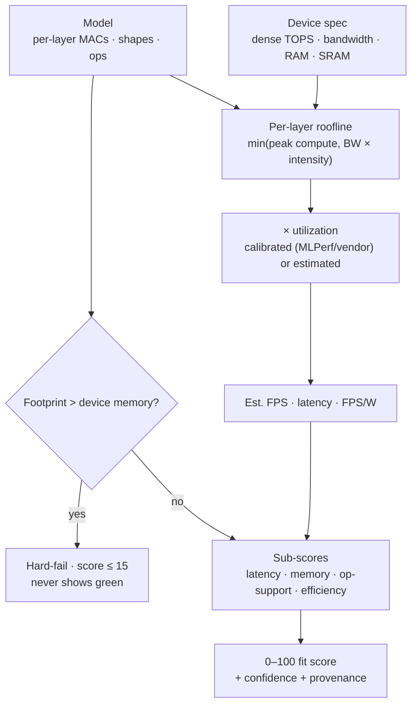
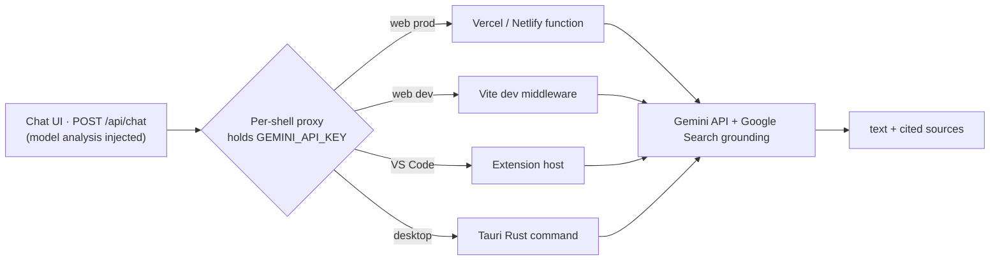

<p align="center">
  
</p>

<h1 align="center">ModelVisio</h1>

<p align="center">
  <b>AI-native neural-network model analyzer for edge deployment.</b><br/>
  Think <i>Netron</i> + a <i>TensorRT-class hardware advisor</i> + an <i>AI copilot</i> — in one tool,
  from a single engine, shipping as a <b>website</b>, a <b>desktop app</b>, and a <b>VS Code extension</b>.
</p>

<p align="center">
  
  
  
  
  
  
  
</p>

---

## What it is

Getting a trained model onto edge hardware is mostly guesswork: *Which accelerator? Will it even
fit? Which ops fall back to CPU? How fast will it actually run?* **ModelVisio** turns that
guesswork into an analysis. Drop in a model and it gives you, in the browser:

- a **Netron-style interactive graph** + a deep per-layer **inspector**,
- a **compiler pre-flight** that flags per-target op-support problems, with a **working auto-fix engine**,
- a **roofline-grounded hardware-fit score** across 21 edge accelerators (estimated FPS, FPS/W, memory fit),
- **format conversion** + **copy-paste deploy recipes**, and
- an **AI copilot** that answers grounded in *your* model's computed analysis.

> **One engine, three shells.** All product logic lives in `packages/` and is mounted unchanged by the
> web, desktop, and VS Code shells — a fix in the core benefits all three automatically.

## Screenshots

> _Branded placeholders — swap in live captures at `docs/screenshots/*.png`._

| | |
|---|---|
|  |  |
|  |  |

## Features

| Capability | What it does |
|---|---|
| 🕸️ **Graph + Inspector** | Netron-style DAG (dagre layout), per-layer shapes, weights, FLOPs/MACs, quantization sensitivity, SVG/PNG export |
| ✅ **Compiler pre-flight** | Per-target (Coral, RKNN, Hailo, Kneron…) op-support + memory warnings, surfaced on the graph |
| 🛠️ **Auto-fix engine** | **Real, reversible** graph transforms — SiLU→HardSwish, SPPF→parallel SPP, Resize→ConvTranspose, channel-prune — that update the graph, stats & compatibility live |
| 📊 **Hardware-fit scoring** | Roofline model across **21 edge accelerators**: estimated FPS, FPS/W, compute- vs memory-bound regime, a **memory-fit hard-fail guard**, and op-support coverage — with calibrated/estimated confidence |
| 🔄 **Converter** | In-browser Graph-JSON / Layers-CSV / Safetensors / NumPy exports + runnable conversion kits |
| 🚀 **Deploy recipes** | One-click TensorRT / HailoRT / RKNN deployment scripts |
| 🤖 **AI copilot** | Google Gemini, fed your model's computed analysis, with Google-Search-grounded citations — key never touches the browser |

## Architecture



## How it works

### 1 · Parsing → a normalized model

Every parser emits the **same `Model` shape** (`{ layers, edges, stats… }`), so the graph, inspector,
and scoring all work unchanged regardless of source format. Large files are parsed in a **Web Worker**
so the UI never blocks.



### 2 · Roofline hardware-fit scoring

The 0–100 score is **computed from your model**, not hand-assigned. It is grounded in the roofline
model (Williams, Waterman & Patterson, CACM 2009): per layer, attainable throughput is
`min(peak_compute, bandwidth × arithmetic_intensity)`, aggregated, then de-rated by a per-workload
**utilization factor**. That factor is **calibrated from real benchmarks** where they exist
(NVIDIA Jetson AGX Orin & Hailo-8 from MLPerf / vendor ResNet-50 numbers) and an honest **estimate**
elsewhere — the UI labels which. A **memory-fit hard-fail** guard ensures a model that can't physically
fit a device never shows green.



### 3 · AI copilot — grounded & key-safe

The Anthropic-style chat request is the same in every shell; only the **proxy** that holds the key
differs. The key **never reaches the browser/WebView** — it lives in a serverless function (web),
a Vite dev middleware (local dev), the extension host (VS Code), or the Tauri Rust side (desktop).
The copilot is fed your model's computed analysis (top device scores, bottleneck & quant-sensitive
layers, compiler issues) so answers are specific and to-the-point.



## Quick start

```bash
# prerequisites: Node ≥ 18, pnpm ≥ 10
pnpm install
pnpm dev          # web app → http://localhost:5173
```

Click **Load Demo · YOLO26n** to explore without a file, or drop in your own model.

### Enable the AI copilot (free)

1. Get a **free** Gemini key at <https://aistudio.google.com/apikey> (no billing required).
2. Copy `.env.example` → `.env` at the repo root and set it:
   ```bash
   GEMINI_API_KEY=your-key-here
   ```
3. Restart `pnpm dev` and open the **AI** tab. (Optional: `MODELVISIO_MODEL`, `MODELVISIO_WEB_SEARCH`.)

The key stays server-side — see [Security](#security).

## The three shells

| Shell | Develop | Build / ship |
|---|---|---|
| **Web** | `pnpm dev` | `pnpm --filter @modelvisio/web build` → deploy to **Vercel** (Root Directory `apps/web`, set `GEMINI_API_KEY`) or **Netlify** (`netlify.toml` included) |
| **Desktop** (Tauri 2) | `pnpm --filter @modelvisio/desktop dev` | `pnpm --filter @modelvisio/desktop build` — requires the [Rust toolchain](https://rustup.rs); push a `desktop-v*` tag to build installers via GitHub Actions |
| **VS Code** | open `apps/vscode`, press **F5** | `pnpm --filter modelvisio-vscode package` → `vsce publish`; set the key in *Settings → ModelVisio: Gemini API Key* |

## Supported formats

Parsers emit the normalized `Model`. **Fully parsed** formats render a real graph; others are detected
and surfaced as metadata (honest UI signal via `FORMAT_SUPPORT`).

| Fully parsed | Detected (metadata) |
|---|---|
| ONNX · TFLite · PyTorch (`.pt/.pth`) · Safetensors · GGUF · NumPy · Darknet | Core ML · OpenVINO · TensorFlow · Caffe · PaddlePaddle · ncnn · RKNN · MNN · MLIR · scikit-learn |

ONNX is the priority target and is built end-to-end (`onnxruntime-web` + `protobufjs`).

## Testing

```bash
pnpm -r --if-present test     # 62 tests (parsers + core scoring/transforms/render)
pnpm -r typecheck             # all packages
```

Each parser is tested against a real fixture; the scoring engine, auto-fix transforms, calibration, and
component render paths all have coverage.

## Repository layout

```
packages/
  core/      React component library — the product (graph, inspector, scoring, converter, chat, fixes)
  parsers/   real model-format parsing → normalized Model (pure TS)
  ai/        Gemini prompt templates + client + server proxy
apps/
  web/       Vite + React; serverless /api/chat proxy; deploys to Vercel/Netlify
  desktop/   Tauri 2 native shell (Rust glue: native menu, file dialog, AI command)
  vscode/    Custom Editor that opens model files in a WebView
```

## Security

- **The Gemini API key is never shipped to the client.** It lives only in the server-side proxy for
  each shell (serverless function / Vite dev middleware / VS Code extension host / Tauri Rust).
- Models are parsed **locally in a Web Worker** — your files are not uploaded anywhere.

## Roadmap

- **Phase 1** ✅ Graph + Inspector + Compiler pre-flight + Auto-fix + Deploy recipes
- **Phase 2** 🔜 Quantization heatmap · on-device benchmarking · deeper hardware-aware advisor
- **Phase 3** AI performance investigator · cross-compiler optimization search
- **Phase 4** AI deployment agent · fleet simulation · model registry / CI-CD

## Tech stack

**TypeScript** everywhere · **React 18** · **Vite 5** · **Tailwind** + a shared theme context ·
**pnpm** workspaces · **Tauri 2** (Rust) · **Google Gemini** API · **dagre** graph layout ·
**Vitest** · `onnxruntime-web` + `protobufjs`.

## Contributing

Features go in `packages/core` (UI) or `packages/parsers` (formats) so all three shells benefit.
Keep parsers pure (no React), ship a fixture-backed test with each parser change, and run
`pnpm -r typecheck && pnpm -r --if-present test` before a PR.

## License

[MIT](LICENSE) © 2026 ModelVisio.
