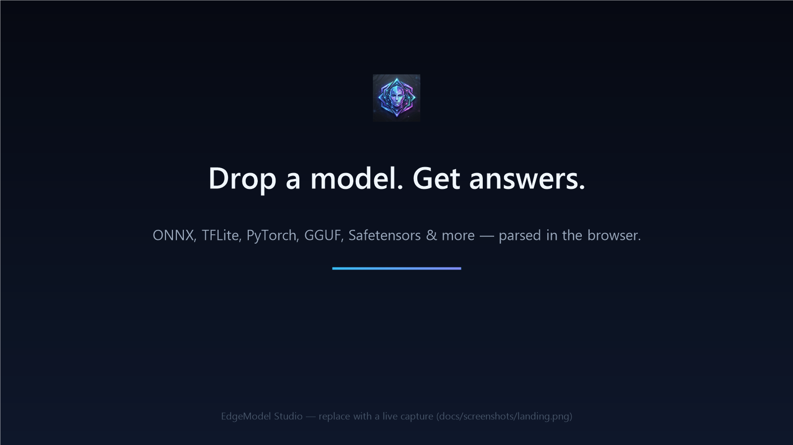
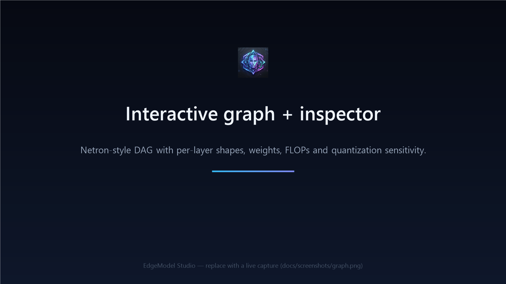
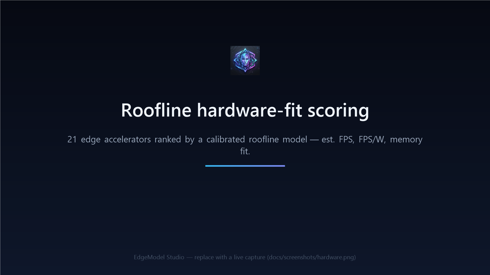
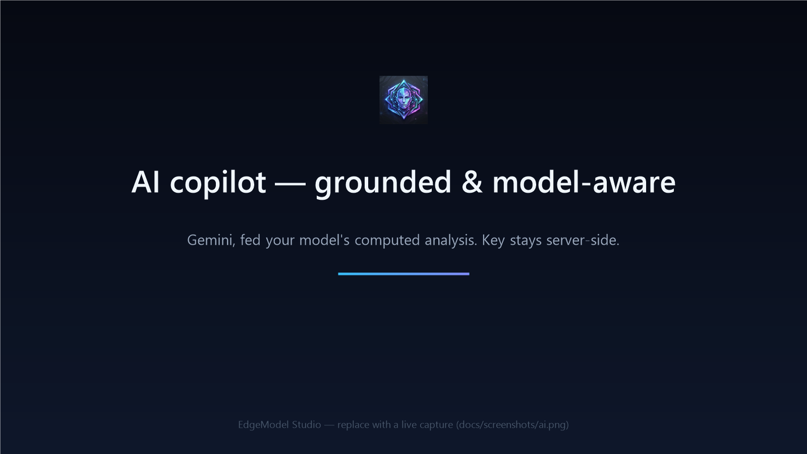
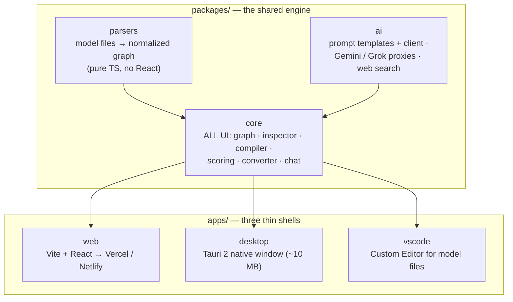
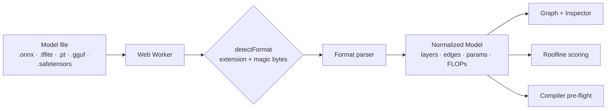
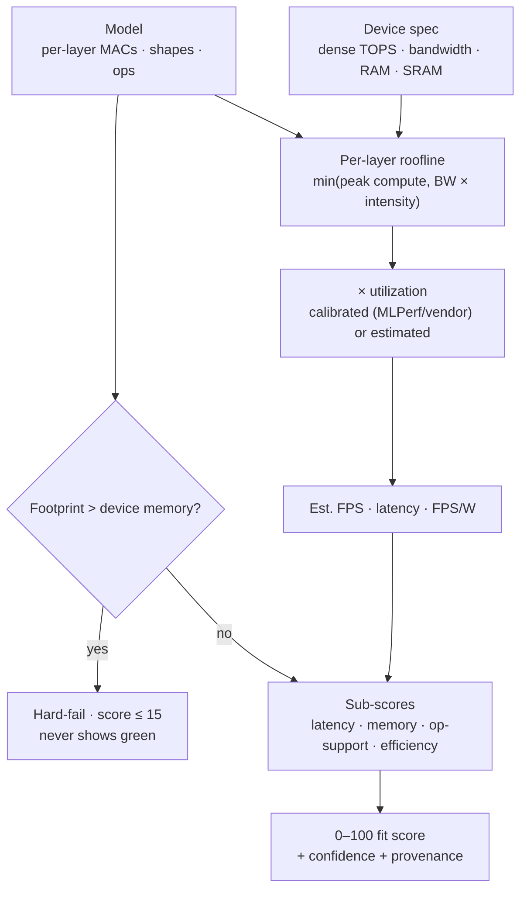
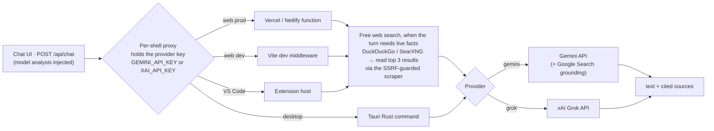

<p align="center">
  
</p>

<h1 align="center">ModelVisio</h1>

<p align="center">
  <b>AI-native neural-network model analyzer for edge deployment.</b><br/>
  Think <i>Netron</i> + a <i>TensorRT-class hardware advisor</i> + an <i>AI copilot</i> — in one tool,
  from a single engine, shipping as a <b>website</b>, a <b>desktop app</b>, and a <b>VS Code extension</b>.
</p>

<p align="center">
  
  
  
  
  
  
  
</p>

---

## What it is

Getting a trained model onto edge hardware is mostly guesswork: *Which accelerator? Will it even
fit? Which ops fall back to CPU? How fast will it actually run?* **ModelVisio** turns that
guesswork into an analysis. Drop in a model and it gives you, in the browser:

- a **Netron-style interactive graph** + a deep per-layer **inspector**,
- a **compiler pre-flight** that flags per-target op-support problems, with a **working auto-fix engine**,
- a **roofline-grounded hardware-fit score** across 21 edge accelerators (estimated FPS, FPS/W, memory fit),
- **format conversion** + **copy-paste deploy recipes**, and
- an **AI copilot** that answers grounded in *your* model's computed analysis.

> **One engine, three shells.** All product logic lives in `packages/` and is mounted unchanged by the
> web, desktop, and VS Code shells — a fix in the core benefits all three automatically.

## Screenshots

> _Branded placeholders — swap in live captures at `docs/screenshots/*.png`._

| | |
|---|---|
|  |  |
|  |  |

## Features

| Capability | What it does |
|---|---|
| 🕸️ **Graph + Inspector** | Netron-style DAG (dagre layout), per-layer shapes, weights, FLOPs/MACs, quantization sensitivity, SVG/PNG export |
| ✅ **Compiler pre-flight** | Per-target (Coral, RKNN, Hailo, Kneron…) op-support + memory warnings, surfaced on the graph |
| 🛠️ **Auto-fix engine** | **Real, reversible** graph transforms — SiLU→HardSwish, SPPF→parallel SPP, Resize→ConvTranspose, channel-prune — that update the graph, stats & compatibility live |
| 📊 **Hardware-fit scoring** | Roofline model across **21 edge accelerators**: estimated FPS, FPS/W, compute- vs memory-bound regime, a **memory-fit hard-fail guard**, and op-support coverage — with calibrated/estimated confidence |
| 🔄 **Converter** | In-browser Graph-JSON / Layers-CSV / Safetensors / NumPy exports + runnable conversion kits |
| 🚀 **Deploy recipes** | One-click TensorRT / HailoRT / RKNN deployment scripts |
| 🤖 **AI copilot** | Google Gemini or xAI Grok, fed your model's computed analysis, with cited live sources (Google Search grounding or a free, keyless web search) — key never touches the browser |

## Architecture


```mermaid
flowchart TB
  subgraph ENGINE["packages/ — the shared engine"]
    parsers["parsers<br/>model files → normalized graph<br/>(pure TS, no React)"]
    core["core<br/>ALL UI: graph · inspector · compiler ·<br/>scoring · converter · chat"]
    ai["ai<br/>prompt templates + client ·<br/>Gemini / Grok proxies · web search"]
  end
  subgraph SHELLS["apps/ — three thin shells"]
    web["web<br/>Vite + React → Vercel / Netlify"]
    desktop["desktop<br/>Tauri 2 native window (~10 MB)"]
    vscode["vscode<br/>Custom Editor for model files"]
  end
  parsers --> core
  ai --> core
  core --> web
  core --> desktop
  core --> vscode
```

## How it works

### 1 · Parsing → a normalized model

Every parser emits the **same `Model` shape** (`{ layers, edges, stats… }`), so the graph, inspector,
and scoring all work unchanged regardless of source format. Large files are parsed in a **Web Worker**
so the UI never blocks.


```mermaid
flowchart LR
  F["Model file<br/>.onnx · .tflite · .pt · .gguf · .safetensors"] --> W["Web Worker"]
  W --> D{"detectFormat<br/>extension + magic bytes"}
  D --> P["Format parser"]
  P --> M["Normalized Model<br/>layers · edges · params · FLOPs"]
  M --> G["Graph + Inspector"]
  M --> S["Roofline scoring"]
  M --> C["Compiler pre-flight"]
```

### 2 · Roofline hardware-fit scoring

The 0–100 score is **computed from your model**, not hand-assigned. It is grounded in the roofline
model (Williams, Waterman & Patterson, CACM 2009): per layer, attainable throughput is
`min(peak_compute, bandwidth × arithmetic_intensity)`, aggregated, then de-rated by a per-workload
**utilization factor**. That factor is **calibrated from real benchmarks** where they exist
(NVIDIA Jetson AGX Orin & Hailo-8 from MLPerf / vendor ResNet-50 numbers) and an honest **estimate**
elsewhere — the UI labels which. A **memory-fit hard-fail** guard ensures a model that can't physically
fit a device never shows green.


```mermaid
flowchart TB
  M["Model<br/>per-layer MACs · shapes · ops"] --> R["Per-layer roofline<br/>min(peak compute, BW × intensity)"]
  D["Device spec<br/>dense TOPS · bandwidth · RAM · SRAM"] --> R
  R --> U["× utilization<br/>calibrated (MLPerf/vendor) or estimated"]
  U --> FPS["Est. FPS · latency · FPS/W"]
  M --> MEM{"Footprint &gt; device memory?"}
  MEM -- yes --> FAIL["Hard-fail · score ≤ 15<br/>never shows green"]
  MEM -- no --> SUB["Sub-scores<br/>latency · memory · op-support · efficiency"]
  FPS --> SUB
  SUB --> SCORE["0–100 fit score<br/>+ confidence + provenance"]
```

### 3 · AI copilot — grounded & key-safe

The Anthropic-style chat request is the same in every shell; only the **proxy** that holds the key
differs. The key **never reaches the browser/WebView** — it lives in a serverless function (web),
a Vite dev middleware (local dev), the extension host (VS Code), or the Tauri Rust side (desktop).
The copilot is fed your model's computed analysis (top device scores, bottleneck & quant-sensitive
layers, compiler issues) so answers are specific and to-the-point.


```mermaid
flowchart LR
  chat["Chat UI · POST /api/chat<br/>(model analysis injected)"] --> PROXY{"Per-shell proxy<br/>holds the provider key<br/>GEMINI_API_KEY or XAI_API_KEY"}
  PROXY -->|web prod| V["Vercel / Netlify function"]
  PROXY -->|web dev| MW["Vite dev middleware"]
  PROXY -->|VS Code| EH["Extension host"]
  PROXY -->|desktop| RS["Tauri Rust command"]
  V & MW & EH --> WS["Free web search, when the turn needs live facts<br/>DuckDuckGo / SearXNG → read top 3 results<br/>via the SSRF-guarded scraper"]
  WS --> PICK{"Provider"}
  RS --> PICK
  PICK -->|gemini| GEM["Gemini API<br/>(+ Google Search grounding)"]
  PICK -->|grok| GROK["xAI Grok API"]
  GEM --> OUT["text + cited sources"]
  GROK --> OUT
```

**Gemini or Grok.** Each proxy talks to Google **Gemini** (default; free key at
<https://aistudio.google.com/apikey>) or xAI **Grok** (key at <https://console.x.ai>, default model
`grok-4.7`). Web proxies pick from `MODELVISIO_PROVIDER` (`gemini` | `grok`; unset → Gemini if a
Gemini key is set, else Grok if `XAI_API_KEY` is). VS Code uses the `modelvisio.provider` setting /
**ModelVisio: Select AI Provider**; the desktop app has a Gemini/Grok toggle in the copilot key panel.
The chat request, UI, and time-budget behavior are the same for both.

**Free web search.** For live facts (docs, links, versions, releases, benchmarks, op support,
comparisons…) the proxy searches the web **without an API key** — DuckDuckGo's no-JS HTML endpoint,
or your own SearXNG instance via `MODELVISIO_SEARXNG_URL` — reads the top 3 results through the same
guarded scraper as pasted URLs, and injects them as fenced, untrusted text the model cites as
`[Web n]`; they come back as the answer's sources. It runs for Grok, and for Gemini when Google Search
grounding (`MODELVISIO_WEB_SEARCH`) is off. `MODELVISIO_FREE_SEARCH=auto|always|off` — `auto` (the
default on Vercel and in `pnpm dev`) searches only when the question asks for something live; Netlify
defaults to `off` (10s free-tier limit). Research is capped at ~9s / 40% of the turn's budget, and if
the search fails (e.g. DuckDuckGo rate-limits a data-centre IP — use SearXNG there) the copilot still
answers and says live results were unavailable. Web and VS Code only (VS Code: DuckDuckGo, set by
`modelvisio.freeWebSearch`); not on desktop yet.

**Paste a URL and the copilot reads it.** Links in a chat message (vendor op-support pages, spec
sheets, GitHub issues, changelogs) are fetched by the server-side `/api/scrape` proxy, reduced to
readable text, and injected as fenced, untrusted grounding for that turn and follow-ups. The scraper
refuses private/loopback/metadata targets — including hostnames that *resolve* to them and every
redirect hop, checked before it's requested — and caps size, time, and content-type. Restrict it to
known docs sites with `MODELVISIO_SCRAPE_ALLOWLIST` (in VS Code, the `modelvisio.scrapeAllowlist`
setting). Works on the web and in VS Code; the desktop shell reports that URL reading isn't available
yet and still answers.

## Quick start

```bash
# prerequisites: Node ≥ 18, pnpm ≥ 10
pnpm install
pnpm dev          # web app → http://localhost:5173
```

Click **Load Demo · YOLO26n** to explore without a file, or drop in your own model.

### Enable the AI copilot (free)

1. Get a **free** Gemini key at <https://aistudio.google.com/apikey> (no billing required) — or an
   xAI Grok key at <https://console.x.ai>.
2. Copy `.env.example` → `.env` at the repo root and set it:
   ```bash
   GEMINI_API_KEY=your-key-here
   # or, for Grok:
   # MODELVISIO_PROVIDER=grok
   # XAI_API_KEY=your-xai-key-here
   ```
3. Restart `pnpm dev` and open the **AI** tab. (Optional: `MODELVISIO_MODEL`, `MODELVISIO_GROK_MODEL`,
   `MODELVISIO_WEB_SEARCH`, `MODELVISIO_FREE_SEARCH`, `MODELVISIO_SEARXNG_URL` — see `.env.example`.)

The key stays server-side — see [Security](#security).

## The three shells

| Shell | Develop | Build / ship |
|---|---|---|
| **Web** | `pnpm dev` | `pnpm --filter @modelvisio/web build` → deploy to **Vercel** (Root Directory `apps/web`, set `GEMINI_API_KEY` or `XAI_API_KEY` + `MODELVISIO_PROVIDER=grok`) or **Netlify** (`netlify.toml` included) |
| **Desktop** (Tauri 2) | `pnpm --filter @modelvisio/desktop dev` | `pnpm --filter @modelvisio/desktop build` — requires the [Rust toolchain](https://rustup.rs); push a `desktop-v*` tag to build installers via GitHub Actions |
| **VS Code** | open `apps/vscode` as the workspace folder, press **F5** | `pnpm package:vscode` → `apps/vscode/modelvisio.vsix`; push a `vscode-v*` tag to attach it to a GitHub Release (and publish to the Marketplace when `VSCE_PAT` is set) |

### VS Code extension

Opens model files in a custom editor running the same core app. Unambiguous model extensions
(`.onnx`, `.tflite`, `.pt`, `.safetensors`, `.gguf`, …) open in ModelVisio by default. Generic ones
(`.json`, `.bin`, `.xml`, `.pb`, `.h5`, …) stay with their usual editor and are offered via
right-click → **Open with ModelVisio**. Parsing runs in a Web Worker, the view live-reloads when the
file changes, and exports open a native Save dialog. For the AI copilot, run **ModelVisio: Set Gemini
API Key** (or **Set Grok (xAI) API Key**, then **Select AI Provider**). Keys go into VS Code's
encrypted Secret Storage and never reach the WebView.

```bash
pnpm build:vscode                         # out/extension.js (esbuild) + media/ (vite)
pnpm --filter modelvisio-vscode test      # host + webview glue unit tests
pnpm package:vscode                       # → apps/vscode/modelvisio.vsix
code --install-extension apps/vscode/modelvisio.vsix
```

Commands, settings, privacy and architecture: [apps/vscode/README.md](apps/vscode/README.md).

## Supported formats

Parsers emit the normalized `Model`. **Fully parsed** formats render a real graph; others are detected
and surfaced as metadata (honest UI signal via `FORMAT_SUPPORT`).

| Fully parsed | Detected (metadata) |
|---|---|
| ONNX · TFLite · PyTorch (`.pt/.pth`) · Safetensors · GGUF · NumPy · Darknet | Core ML · OpenVINO · TensorFlow · Caffe · PaddlePaddle · ncnn · RKNN · MNN · MLIR · scikit-learn |

ONNX is the priority target and is built end-to-end (`onnxruntime-web` + `protobufjs`).

## Testing

```bash
pnpm -r --if-present test     # every suite (parsers + core scoring/transforms/render + ai providers/search/scrape/client)
pnpm -r typecheck             # all packages
```

Each parser is tested against a real fixture; the scoring engine, auto-fix transforms, calibration, and
component render paths all have coverage.

## Repository layout

```
packages/
  core/      React component library — the product (graph, inspector, scoring, converter, chat, fixes)
  parsers/   real model-format parsing → normalized Model (pure TS)
  ai/        prompt templates + client; server-only Gemini/Grok proxies, free web search, URL scraper
apps/
  web/       Vite + React; serverless /api/chat proxy; deploys to Vercel/Netlify
  desktop/   Tauri 2 native shell (Rust glue: native menu, file dialog, AI command)
  vscode/    Custom Editor that opens model files in a WebView
```

## Security

- **The AI provider key (Gemini or xAI Grok) is never shipped to the client.** It lives only in the
  server-side proxy for each shell (serverless function / Vite dev middleware / VS Code extension
  host / Tauri Rust).
- **Crawled text is untrusted.** Pasted URLs and free-web-search result pages are read through the
  SSRF-guarded scraper (no private/loopback/metadata hosts, size/time caps, optional allowlist) and
  fenced in the prompt as data the model must not take instructions from.
- Models are parsed **locally in a Web Worker** — your files are not uploaded anywhere.

## Roadmap

- **Phase 1** ✅ Graph + Inspector + Compiler pre-flight + Auto-fix + Deploy recipes
- **Phase 2** 🔜 Quantization heatmap · on-device benchmarking · deeper hardware-aware advisor
- **Phase 3** AI performance investigator · cross-compiler optimization search
- **Phase 4** AI deployment agent · fleet simulation · model registry / CI-CD

## Tech stack

**TypeScript** everywhere · **React 18** · **Vite 5** · **Tailwind** + a shared theme context ·
**pnpm** workspaces · **Tauri 2** (Rust) · **Google Gemini** / **xAI Grok** APIs · **dagre** graph layout ·
**Vitest** · `onnxruntime-web` + `protobufjs`.

## Contributing

Contributions are welcome — from a one-line fix to a whole new format parser or edge device.
The project is deliberately structured so **one change benefits all three shells**: put product
logic in `packages/`, and the web, desktop, and VS Code apps pick it up automatically.

> **Golden rule.** Features go in `packages/core` (UI) or `packages/parsers` (formats). The apps in
> `apps/` are thin shells — only platform glue (file pickers, hosting, WebView bridges) lives there.

### Ways to contribute

| You want to… | Start here |
|---|---|
| 🐛 Report a bug | [Open an issue](https://github.com/Premchand006/ModelVisio/issues/new) → **Bug report** |
| 💡 Request a feature / device / format | [Open an issue](https://github.com/Premchand006/ModelVisio/issues/new) → **Feature request** |
| 🧩 Add a **model-format parser** | `packages/parsers` — see [Add-ons](#add-ons--extending-modelvisio) |
| 🖥️ Add an **edge accelerator** to hardware scoring | `packages/core/src/data/hardware.ts` |
| 🛠️ Add a **compiler auto-fix** | `packages/core/src/fixes/transforms.ts` |
| 🤖 Add an **AI provider** | `packages/ai` — see [Add-ons](#add-ons--extending-modelvisio) |
| 🎨 Improve UI / a component | `packages/core/src/components` |
| 📖 Improve docs | this README / `apps/*/README.md` |
| 💬 Ask a question / share an idea | [Discussions](https://github.com/Premchand006/ModelVisio/discussions) |

### Development setup

```bash
git clone https://github.com/Premchand006/ModelVisio.git
cd ModelVisio
pnpm install
pnpm dev                         # web app → http://localhost:5173
pnpm -r typecheck                # type-check every package
pnpm -r --if-present test        # run the test suite
```

New to the codebase? Read [`ARCHITECTURE.md`](ARCHITECTURE.md) — it's the concise architecture + conventions brief.
Then `pnpm dev`, click **Load Demo · YOLO26n**, and poke around.

### Add-ons — extending ModelVisio

The engine is built to grow along four axes; each is a self-contained, pure-TS addition with a test.

- **New format parser** (`packages/parsers`) — the highest-impact contribution. A parser takes raw
  file bytes and emits the normalized `Model` shape (`{ layers, edges, stats… }`) that the whole app
  already understands, so a new format lights up the graph, inspector, scoring, and copilot for free.
  1. Add `detectFormat` handling (extension + magic bytes) and register it in `src/registry.ts`.
  2. Emit the normalized `Model` (see the `ModelLayer` / `Model` shapes in [`ARCHITECTURE.md`](ARCHITECTURE.md)).
  3. **Ship a test with a real fixture model** — `packages/parsers/test` (kept small).
  4. If it fully parses, add it to the "Fully parsed" list; otherwise wire it into `FORMAT_SUPPORT`
     so the UI honestly shows "detected (metadata)".
- **New edge device** (`hardware.ts`) — add a `DeviceSpec` (dense TOPS, bandwidth, RAM/SRAM, power).
  Prefer a **calibrated** utilization factor from a real benchmark (MLPerf/vendor) and label it as
  such; an honest estimate is fine too — just mark it.
- **New auto-fix** (`transforms.ts`) — a pure, **reversible** graph transform plus its applicability
  check, so the compiler pre-flight can offer and undo it live.
- **New AI provider** (`packages/ai`) — follow `src/grok.ts`: a standalone, server-only module (not
  re-exported from `index.ts`, so its key never enters the browser bundle) that takes the
  Anthropic-style `{ system, messages }` and returns `{ text, sources }`.
  1. Honor the time-budget contract: abort at `timeBudgetMs` with `Error("TIMEOUT")`, and only wait
     out a 429/5xx retry if it still fits the budget.
  2. No runtime relative imports — `apps/web/vite.config.ts` loads these files with Node's
     type-stripping, so use erasable TS syntax and `import type` for sibling modules.
  3. Add a `package.json` export, then register the provider + its key/model env vars in
     `src/providers.ts`.
  4. Wire it into the proxies (`apps/web/api/chat.ts`, `netlify/functions/chat.ts`, the dev
     middleware in `vite.config.ts`), the VS Code bridge (`apps/vscode/src/bridge.ts` + a key slot
     in `apiKey.ts`), and the desktop Rust `chat` command.
  5. **Ship a test with a mocked `fetch`** (`packages/ai/test`) — no real network calls or keys.

### Reporting issues

Good issues get fixed faster. Please include:

- **Bugs:** what you did, what you expected, what happened; the **model format** (and a minimal sample
  file if shareable); browser/OS or app version; and any console errors.
- **Security / key concerns:** do **not** open a public issue — see [Security](#security) and email the
  maintainer instead.

### Pull requests

1. **Branch** off `main` and keep the PR scoped to **one** thing (mirrors the build-order in `ARCHITECTURE.md`).
2. Follow the conventions: one component per file in `core`; **pure functions, no React imports** in
   `parsers/` and `ai/`; keep the shared theme context; match the surrounding style.
3. Every **parser change ships a fixture-backed test.**
4. **Before pushing**, make it green:
   ```bash
   pnpm -r typecheck && pnpm -r --if-present test
   ```
5. Write a clear description (what + why); link the issue it closes. Small, reviewable PRs merge fastest.

### Code of conduct

Be respectful and constructive — assume good intent, keep feedback about the code. Harassment or
dismissiveness isn't welcome. Maintainers may edit/close contributions that don't fit the project's
direction; that's not personal.

## License

[MIT](LICENSE) © 2026 Premchand ([@Premchand006](https://github.com/Premchand006)).
